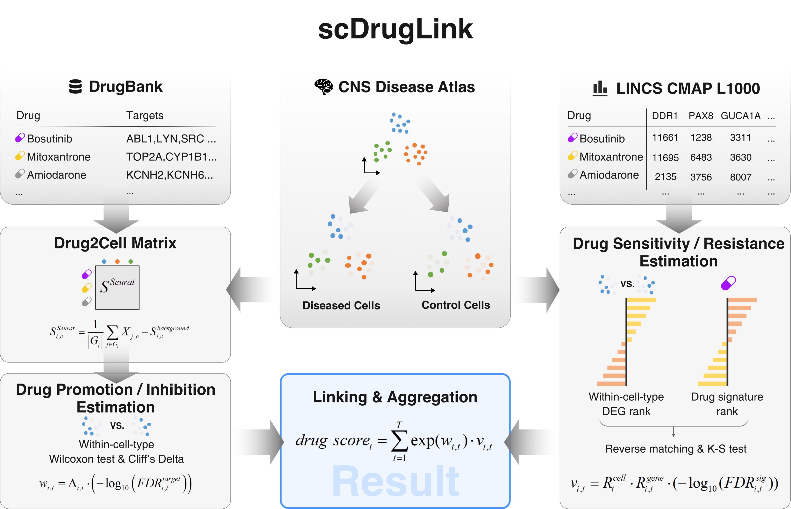

# scDrugLink: Single-Cell Drug Repurposing for CNS Diseases via Computationally Linking Drug Targets and Perturbation Signatures
`scDrugLink` is an R package designed to integrate disease single-cell transcriptomics data with drug target information (for drug promotion/inhibition effect estimation) and drug perturbation signatures (for drug sensitivity/resistance effect estimation) to compute robust drug therapeutic scores. It is applicable to a variety of diseases and tissues, such as glioblastoma (GBM), multiple sclerosis (MS), and Alzheimer's disease (AD) in central nervous system (CNS). Drug repurposing by therapeutic score computation and ranking can be performed both at the cell-type level and the whole-atlas level.



## Installation
`scDrugLink` requires several R packages: `Asgard`, `cmapR`, `effsize`, and `Seurat`. Please first install `devtools` and `BiocManager` if it is not already done.
```
install.packages('devtools')
devtools::install_github("lanagarmire/Asgard")

if (!requireNamespace("BiocManager", quietly = TRUE))
    install.packages("BiocManager")
BiocManager::install("cmapR")

install.packages("effsize")
install.packages("Seurat")
```
Then install scDrugLink
```
devtools::install_github("lhbcb/scDrugLink")
```

## Tutorial
### 1. Load disease scRNA-seq data and prepare drug targets and perturbation signatures
Here, we take drug repurposing for GBM as an example to demonstrate the steps required to reproduce the results for the disease in the scDrugLink paper. The disease scRNA-seq data can be downloaded from GliomaAtlas (https://gbmvisium.snu.ac.kr/seuratObjects/); two GBM patient samples (SNU24 and SNU25) and one control sample (SNU57normal) are used as the GBM dataset for our study. 
```
seurat_obj <- readRDS("gbm.rds")
disease <- "GBM" # the disease condition
control <- "control" # the control condition
# standardise the column names in meta data
seurat_obj@meta.data$cell_type <- seurat_obj@meta.data$finalCelltype_15Sept
seurat_obj@meta.data$disease <- seurat_obj@meta.data$histology
# remove the "Doublet" cell type and cell types with < 3 diseased or control cells
seurat_obj_subset <- subset(x = seurat_obj, subset = cell_type != "Doublet") 
meta_data <- seurat_obj_subset@meta.data
counts <- table(meta_data$cell_type, meta_data$disease)
remain_cell_types <- rownames(counts)[apply(counts, 1, function(x) all(x >= 3))]
dat <- subset(seurat_obj_subset, cell_type %in% remain_cell_types)
```

### 2. Build Drug2Cell matrix based on drug targets

### 3. Estimate drug promotion/inhibition effects

### 4. Identify intra-cell-type differentially expressed genes (DEGs)

### 5. Estimate drug sensitivity/resistance effects

### 6. Compute final drug therapeutic score

### 7. Evaluate drug repurposing performance (optional)
